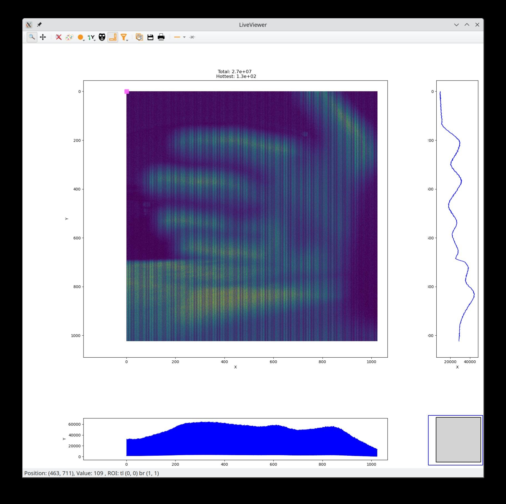

# Photron Highspeed Camera Linux Development

ANY CONTENT IN THIS REPOSITORY CAN DAMAGE YOUR CAMERA!!!
USE AT YOUR WON RISK!

The repo captures the work in progress state of understanding the communication protocol between a Photron FASTCAM NOVA S12 and the provided Windows sdk https://photron.com/pfv/ with the goal to write a linux sdk.
It is mostly a brain dump and short description what has been done and not a working software.
It should be a good starting point for further study.
We manged to receive a live image on linux, but so far did not manage to set individual parameters, but only replay what was set by the windows sdk.

The only thing missing was the correct 12 bit packing.

Feel free to contact me if you have questions or ideas to contribute.

The methodology was to first start with a small windows programm and the real camera and analyse the pcap files.

The camera mostly communicates via UDP on port 2000 on the camera side and multiple random ones on the host.

This provided enough insight into sequence numbers and format specifications.

## Simulating the camera

To not damage the camera, we first simulated the camera and try to talk to our simulator with the windows application.

This is the [fastapi app](simulator/camera.py) which is listening on UDP port 2000 and provides a http endpoint on port 5000.

It behaves correctly with sequence numbers and format of paramters and images.

## Parameter dialogs

The hard part is to understand the parameter mapping from the function calls of the SDK to the binary values in the packets.

To automate this, we wrote a windows program which just dumps all configuration of the camera.

As every parameter has its own function, we automated the reading of them with a script.

First get the header file `PDCFUNC.h` from the SDK and process it with `gcc -E PDCFUNC.h > preped` where the [preped file](header/preped) is available.
Some functions don't work and were deleted.

Given this list of function signatures, we created a [notebook](notebooks/cgen.ipynb) which parses them and creates a `func.c` file which prints the return values of all paramter getters.

The [funcs.cpp](windows/funcs.cpp) is then included in the [testing.cpp](windows/testing.cpp) executable which is a collection of minimal interactions.
After opening the camera, it uses `test_all(dev);` to get the current parameters and print them to stdout.

Using a [bat script](windows/loop.bat) we ran all getters and dumped the result to the camera fastapi. On every connection, the simulated camera returned slightly different values.
The messages sent are in the same format as the `og_responses` in [dialog.py](simulator/dialog.py) together with the output of the windows script are available in the `dump` directory.

A preliminary correlation between values and parameter setting started in this [notebook](notebooks/correlate.ipynb)

## Talking to the Camera

After some confidence with the simulator and the SDK, we started talking to the hardware without the windows SDK. The initial try is [a python script](sdk/main.py) which replays the correct parameters to get an initial frame.

As this worked, we built a [fastapi](sdk/sm.py) which has the correct statemachine for the camera and can send the correct command to query a live frame.
The app continuously queries a live image and exposes the last acquired one via an http endpoint. This may be viewed as in the live viewer above.

The decoding of the image data is a 12 bit packed format and is correctly decoded with this [notebook](notebooks/imgproc.ipynb).

## Flags

There are 2 bytes in every communication which I so far did not understand. They seem not to matter and are somewhat random.
There is a huge number of these [flags captured](data/manyflags.zip) from interactions with the SDK, and a [notebook](notebooks/flags.ipynb) which tries to make sense of it.
So far, it is a mystery what they are used for.

